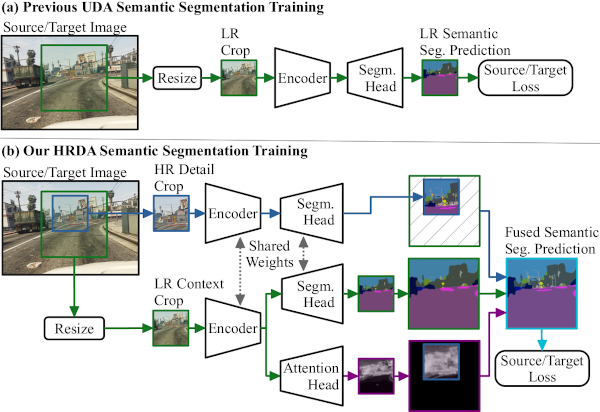
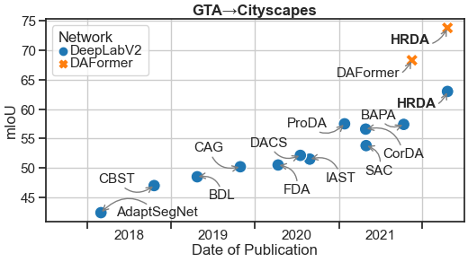
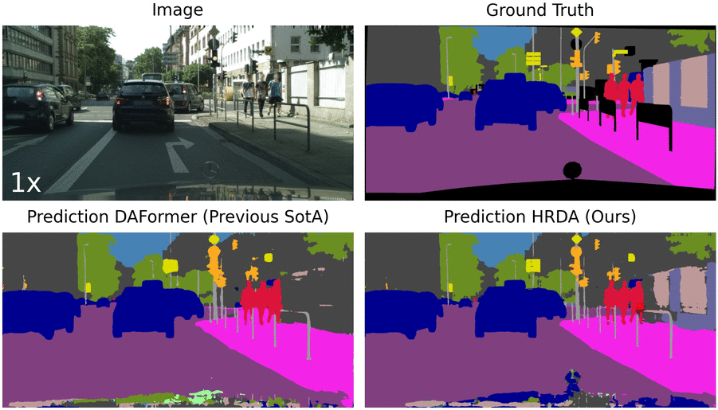

## HRDA: Context-Aware High-Resolution Domain-Adaptive Semantic Segmentation

**by [Lukas Hoyer](https://lhoyer.github.io/), [Dengxin Dai](https://vas.mpi-inf.mpg.de/dengxin/), and [Luc Van Gool](https://scholar.google.de/citations?user=TwMib_QAAAAJ&hl=en)**

**[[ECCV22 Paper]](https://arxiv.org/pdf/2204.13132)**
**[[Extension Paper]](https://arxiv.org/pdf/2304.13615.pdf)**

:bell: **News:**

* [2023-09-26] We are happy to announce that our [Extension Paper](https://arxiv.org/pdf/2304.13615.pdf) on domain generalization and clear-to-adverse-weather UDA was accapted at **PAMI**. 
* [2023-08-25] We are happy to announce that our follow-up work [EDAPS](https://github.com/susaha/edaps) on panoptic segmentation UDA was accepted at **ICCV23**.
* [2023-04-27] We further extend HRDA to domain generalization and clear-to-adverse-weather UDA in the [Extension Paper](https://arxiv.org/pdf/2304.13615.pdf).
* [2023-02-28] We are happy to announce that our follow-up work [MIC](https://github.com/lhoyer/MIC) on context-enhanced UDA was accepted at **CVPR23**.
* [2022-07-05] We are happy to announce that HRDA was accepted at **ECCV22**.

## Overview

**Unsupervised domain adaptation (UDA)** aims to adapt a model trained on
synthetic data to real-world data without requiring expensive annotations of
real-world images. As UDA methods for semantic segmentation are usually GPU
memory intensive, most **previous methods operate only on downscaled images**.
We question this design as low-resolution predictions often fail to preserve
fine details. The alternative of training with random crops of high-resolution
images alleviates this problem but falls short in capturing long-range,
domain-robust context information.

Therefore, we propose **HRDA**, a multi-resolution training approach for UDA,
that combines the strengths of small high-resolution crops to **preserve fine
segmentation details** and large low-resolution crops to **capture long-range
context dependencies** with a learned scale attention, while maintaining a
**manageable GPU memory** footprint.



HRDA enables adapting small objects and preserving fine segmentation details.
It significantly improves the state-of-the-art performance **by 5.5 mIoU for
GTA→Cityscapes** and **by 4.9 mIoU for Synthia→Cityscapes**, resulting in an
unprecedented performance of 73.8 and 65.8 mIoU, respectively.



The more detailed domain-adaptive semantic segmentation of HRDA, compared to
the previous state-of-the-art UDA method DAFormer, can also be observed in
example predictions from the Cityscapes validation set.



https://user-images.githubusercontent.com/1277888/181128057-27b8039f-a4c9-4f6d-9aa8-9b7f364d8921.mp4


HRDA can be further **extended to domain generalization** lifting the requirement
of access to target images. Also in domain generalization,
HRDA significantly improves the state-of-the-art performance by **+4.2 mIoU**.

For more information on HRDA, please check our
[[ECCV Paper]](https://arxiv.org/pdf/2204.13132) and the [[Extension Paper]](https://arxiv.org/pdf/2304.13615.pdf).

If you find HRDA useful in your research, please consider citing:

```
@InProceedings{hoyer2022hrda,
  title={{HRDA}: Context-Aware High-Resolution Domain-Adaptive Semantic Segmentation},
  author={Hoyer, Lukas and Dai, Dengxin and Van Gool, Luc},
  booktitle={Proceedings of the European Conference on Computer Vision (ECCV)},
  year={2022}
}

@Article{hoyer2023domain,
  title={Domain Adaptive and Generalizable Network Architectures and Training Strategies for Semantic Image Segmentation},
  author={Hoyer, Lukas and Dai, Dengxin and Van Gool, Luc},
  journal={arXiv preprint arXiv:2304.13615},
  year={2023}
}
```

## Comparison with SOTA UDA

HRDA significantly outperforms previous works on several UDA benchmarks.
This includes synthetic-to-real adaptation on GTA→Cityscapes and
Synthia→Cityscapes as well as clear-to-adverse-weather adaptation on
Cityscapes→ACDC and Cityscapes→DarkZurich.

|                     | GTA→CS(val)    | Synthia→CS(val)    | CS→ACDC(test) | CS→DarkZurich(test) |
|---------------------|----------------|--------------------|---------------|---------------------|
| ADVENT [1]          | 45.5           | 41.2               | 32.7          | 29.7                |
| BDL [2]             | 48.5           | --                 | 37.7          | 30.8                |
| FDA [3]             | 50.5           | --                 | 45.7          | --                  |
| DACS [4]            | 52.1           | 48.3               | --            | --                  |
| ProDA [5]           | 57.5           | 55.5               | --            | --                  |
| MGCDA [6]           | --             | --                 | 48.7          | 42.5                |
| DANNet [7]          | --             | --                 | 50.0          | 45.2                |
| DAFormer (Ours) [8] | 68.3           | 60.9               | 55.4&ast;     | 53.8&ast;           |
| HRDA (Ours)         | **73.8**       | **65.8**           | **68.0***     | **55.9***           |

&ast; New results of our [extension paper](https://arxiv.org/pdf/2304.13615.pdf)

References:

1. Vu et al. "Advent: Adversarial entropy minimization for domain adaptation in semantic segmentation" in CVPR 2019.
2. Li et al. "Bidirectional learning for domain adaptation of semantic segmentation" in CVPR 2019.
3. Yang et al. "Fda: Fourier domain adaptation for semantic segmentation" in CVPR 2020.
4. Tranheden et al. "Dacs: Domain adaptation via crossdomain mixed sampling" in WACV 2021.
5. Zhang et al. "Prototypical pseudo label denoising and target structure learning for domain adaptive semantic segmentation" in CVPR 2021.
6. Sakaridis et al. "Map-guided curriculum domain adaptation and uncertaintyaware evaluation for semantic nighttime image segmentation" in TPAMI, 2020.
7. Wu et al. "DANNet: A one-stage domain adaptation network for unsupervised nighttime semantic segmentation" in CVPR, 2021.
8. Hoyer et al. "DAFormer: Improving Network Architectures and Training Strategies for Domain-Adaptive Semantic Segmentation" in CVPR, 2022.

## Comparison with SOTA Domain Generalization (DG)

HRDA and DAFormer significantly outperform previous works on domain generalization from GTA to real street scenes.

| DG Method           | Cityscapes     | BDD100K        | Mapillary        | Avg.           |
|---------------------|----------------|----------------|------------------|----------------|
| IBN-Net [1,5]       | 37.37          | 34.21          | 36.81            | 36.13          |
| DRPC [2]            | 42.53          | 38.72          | 38.05            | 39.77          |
| ISW [3,5]           | 37.20          | 33.36          | 35.57            | 35.38          |
| SAN-SAW [4]         | 45.33          | 41.18          | 40.77            | 42.43          |
| SHADE [5]           | 46.66          | 43.66          | 45.50            | 45.27          |
| DAFormer (Ours) [6] | 52.65&ast;     | 47.89&ast;     | 54.66&ast;       | 51.73&ast;     |
| HRDA (Ours)         | **57.41&ast;** | **49.11&ast;** | **61.16&ast;**   | **55.90&ast;** |

&ast; New results of our [extension paper](https://arxiv.org/pdf/2304.13615.pdf)

References:

1. Pan et al. "Two at once: Enhancing learning and generalization capacities via IBN-Net" in ECCV, 2018.
2. Yue et al. "Domain randomization and pyramid consistency: Simulation-to-real generalization without accessing target domain data" ICCV, 2019.
3. Choi et al. "RobustNet: Improving Domain Generalization in Urban-Scene Segmentation via Instance Selective Whitening" in CVPR, 2021.
4. Peng et al. "Semantic-aware domain generalized segmentation" in CVPR, 2022.
5. Zhao et al. "Style-Hallucinated Dual Consistency Learning for Domain Generalized Semantic Segmentation" in ECCV, 2022.
6. Hoyer et al. "DAFormer: Improving Network Architectures and Training Strategies for Domain-Adaptive Semantic Segmentation" in CVPR, 2022.

## Setup Environment

For this project, we used python 3.8.5. We recommend setting up a new virtual
environment:

```shell
python -m venv ~/venv/hrda
source ~/venv/hrda/bin/activate
```

In that environment, the requirements can be installed with:

```shell
pip install -r requirements.txt -f https://download.pytorch.org/whl/torch_stable.html
pip install mmcv-full==1.3.7  # requires the other packages to be installed first
```

Further, please download the MiT weights from SegFormer using the
following script. If problems occur with the automatic download, please follow
the instructions for a manual download within the script.

```shell
sh tools/download_checkpoints.sh
```

## Setup Datasets

**Cityscapes:** Please, download leftImg8bit_trainvaltest.zip and
gt_trainvaltest.zip from [here](https://www.cityscapes-dataset.com/downloads/)
and extract them to `data/cityscapes`.

**GTA:** Please, download all image and label packages from
[here](https://download.visinf.tu-darmstadt.de/data/from_games/) and extract
them to `data/gta`.

**Synthia (Optional):** Please, download SYNTHIA-RAND-CITYSCAPES from
[here](http://synthia-dataset.net/downloads/) and extract it to `data/synthia`.

**ACDC (Optional):** Please, download rgb_anon_trainvaltest.zip and
gt_trainval.zip from [here](https://acdc.vision.ee.ethz.ch/download) and
extract them to `data/acdc`. Further, please restructure the folders from
`condition/split/sequence/` to `split/` using the following commands:

```shell
rsync -a data/acdc/rgb_anon/*/train/*/* data/acdc/rgb_anon/train/
rsync -a data/acdc/rgb_anon/*/val/*/* data/acdc/rgb_anon/val/
rsync -a data/acdc/gt/*/train/*/*_labelTrainIds.png data/acdc/gt/train/
rsync -a data/acdc/gt/*/val/*/*_labelTrainIds.png data/acdc/gt/val/
```

**Dark Zurich (Optional):** Please, download the Dark_Zurich_train_anon.zip
and Dark_Zurich_val_anon.zip from
[here](https://www.trace.ethz.ch/publications/2019/GCMA_UIoU/) and extract it
to `data/dark_zurich`.

**BDD100K (Optional):** Please, download the `10K Images` and `Segmentation` from
[here](https://bdd-data.berkeley.edu/portal.html#download) and extract it
to `data/bdd100k`.

**Mapillary (Optional):** Please, download the mapillary-vistas-dataset_public_v1.2.zip
from [here](https://www.mapillary.com/dataset/vistas) and extract it
to `data/mapillary`.

The final folder structure should look like this:

```none
HRDA
├── ...
├── data
│   ├── acdc (optional)
│   │   ├── gt
│   │   │   ├── train
│   │   │   ├── val
│   │   ├── rgb_anon
│   │   │   ├── train
│   │   │   ├── val
│   ├── bdd100k (optional)
│   │   ├── images/10k/val
│   │   ├── labels/sem_seg/masks/val
│   ├── cityscapes
│   │   ├── leftImg8bit
│   │   │   ├── train
│   │   │   ├── val
│   │   ├── gtFine
│   │   │   ├── train
│   │   │   ├── val
│   ├── dark_zurich (optional)
│   │   ├── gt
│   │   │   ├── val
│   │   ├── rgb_anon
│   │   │   ├── train
│   │   │   ├── val
│   ├── gta
│   │   ├── images
│   │   ├── labels
│   ├── mapillary (optional)
│   │   ├── validation/images
│   │   ├── validation/labels
│   ├── synthia (optional)
│   │   ├── RGB
│   │   ├── GT
│   │   │   ├── LABELS
├── ...
```

**Data Preprocessing:** Finally, please run the following scripts to convert the label IDs to the
train IDs and to generate the class index for RCS:

```shell
python tools/convert_datasets/gta.py data/gta --nproc 8
python tools/convert_datasets/cityscapes.py data/cityscapes --nproc 8
python tools/convert_datasets/synthia.py data/synthia/ --nproc 8
python tools/convert_datasets/mapillary.py data/mapillary/ --nproc 8
```

## Testing & Predictions

The provided HRDA checkpoint trained on GTA→Cityscapes
(already downloaded by `tools/download_checkpoints.sh`) can be tested on the
Cityscapes validation set using:

```shell
sh test.sh work_dirs/gtaHR2csHR_hrda_246ef
```

The predictions are saved for inspection to
`work_dirs/gtaHR2csHR_hrda_246ef/preds`
and the mIoU of the model is printed to the console. The provided checkpoint
should achieve 73.79 mIoU. Refer to the end of
`work_dirs/gtaHR2csHR_hrda_246ef/20220215_002056.log` for
more information such as the class-wise IoU.

If you want to visualize the LR predictions, HR predictions, or scale
attentions of HRDA on the validation set, please refer to [test.sh](test.sh) for
further instructions.

## Training

For convenience, we provide an [annotated config file](configs/hrda/gtaHR2csHR_hrda.py)
of the final HRDA. A training job can be launched using:

```shell
python run_experiments.py --config configs/hrda/gtaHR2csHR_hrda.py
```

The logs and checkpoints are stored in `work_dirs/`.

For the other experiments in our paper, we use a script to automatically
generate and train the configs:

```shell
python run_experiments.py --exp <ID>
```

More information about the available experiments and their assigned IDs, can be
found in [experiments.py](experiments.py). The generated configs will be stored
in `configs/generated/`.

When evaluating a model trained on Synthia→Cityscapes, please note that the
evaluation script calculates the mIoU for all 19 Cityscapes classes. However,
Synthia contains only labels for 16 of these classes. Therefore, it is a common
practice in UDA to report the mIoU for Synthia→Cityscapes only on these 16
classes. As the Iou for the 3 missing classes is 0, you can do the conversion
`mIoU16 = mIoU19 * 19 / 16`.

The results for Cityscapes→ACDC and Cityscapes→DarkZurich are reported on
the test split of the target dataset. To generate the predictions for the test
set, please run:

```shell
python -m tools.test path/to/config_file path/to/checkpoint_file --test-set --format-only --eval-option imgfile_prefix=labelTrainIds to_label_id=False
```

The predictions can be submitted to the public evaluation server of the
respective dataset to obtain the test score.

## Domain Generalization

HRDA/DAFormer for domain generalization (DG) is located on the DG branch, which can
be checked out with:

```shell
git checkout dg
```

They can be trained for DG using:

```shell
python run_experiments.py --exp 50
```

For further details, please refer to [experiment.py](experiments.py). The model is
directly evaluated on Cityscapes during training with GTA data only. It can be additionally
evaluated on BDD100K and Mapillary with [tools/test.py](tools/test.py):

```shell
python -m tools.test path/to/config_file path/to/checkpoint_file --eval mIoU --dataset BDD100K
python -m tools.test path/to/config_file path/to/checkpoint_file --eval mIoU --dataset Mapillary --eval-option efficient_test=True
```

## Checkpoints

Below, we provide checkpoints of HRDA for different benchmarks.
They come together with the log files of their training.
As the results in the paper are provided as the mean over three random
seeds, we provide the checkpoint with the median validation performance here.

* [HRDA for GTA→Cityscapes](https://drive.google.com/file/d/1O6n1HearrXHZTHxNRWp8HCMyqbulKcSW/view?usp=sharing)
* [HRDA for Synthia→Cityscapes](https://drive.google.com/file/d/1V6kSLq3FH8o-FJf-syiiQx6E74ML9Huw/view?usp=sharing)
* [HRDA for Cityscapes→ACDC](https://drive.google.com/file/d/1Pwb1NAKx-WeVdhKEfafn29_JP4iEyKQM/view?usp=sharing)
* [HRDA for Cityscapes→DarkZurich](https://drive.google.com/file/d/1QEfolITfZWA_gvtTtVgv8oa-exP9PEo0/view?usp=sharing)
* [HRDA for GTA Domain Generalization](https://drive.google.com/file/d/19MA5NJTFJrbwAdgYeqjfSaPCx9Fnmm4M/view?usp=sharing)
* [DAFormer for GTA Domain Generalization](https://drive.google.com/file/d/1up9x3R3HtU_MjM6F89xNIHzPbIqBSacx/view?usp=sharing)

The checkpoints come with the training logs. Please note that:

* The logs provide the mIoU for 19 classes. For Synthia→Cityscapes, it is
  necessary to convert the mIoU to the 16 valid classes. Please, read the
  section above for converting the mIoU.
* The logs provide the mIoU on the validation set. For Cityscapes→ACDC and
  Cityscapes→DarkZurich the results reported in the paper are calculated on the
  test split. For DarkZurich, the performance significantly differs between
  validation and test split. Please, read the section above on how to obtain
  the test mIoU.
* The logs for domain generalization (DG) provide the validation performance on Cityscapes.
  Please, refer to the section above to evaluate the checkpoint on BDD100K and Mapillary.

## Framework Structure

This project is based on [mmsegmentation version 0.16.0](https://github.com/open-mmlab/mmsegmentation/tree/v0.16.0).
For more information about the framework structure and the config system,
please refer to the [mmsegmentation documentation](https://mmsegmentation.readthedocs.io/en/latest/index.html)
and the [mmcv documentation](https://mmcv.readthedocs.ihttps://arxiv.org/abs/2007.08702o/en/v1.3.7/index.html).

The most relevant files for HRDA are:

* [configs/hrda/gtaHR2csHR_hrda.py](configs/hrda/gtaHR2csHR_hrda.py):
  Annotated config file for the final HRDA.
* [mmseg/models/segmentors/hrda_encoder_decoder.py](mmseg/models/segmentors/hrda_encoder_decoder.py):
  Implementation of the HRDA multi-resolution encoding with context and detail crop.
* [mmseg/models/decode_heads/hrda_head.py](mmseg/models/decode_heads/hrda_head.py):
  Implementation of the HRDA decoding with multi-resolution fusion and scale attention.
* [mmseg/models/uda/dacs.py](mmseg/models/uda/dacs.py):
  Implementation of the DAFormer self-training.

## Acknowledgements

HRDA is based on the following open-source projects. We thank their
authors for making the source code publicly available.

* [DAFormer](https://github.com/lhoyer/DAFormer)
* [MMSegmentation](https://github.com/open-mmlab/mmsegmentation)
* [SegFormer](https://github.com/NVlabs/SegFormer)
* [DACS](https://github.com/vikolss/DACS)
* [SHADE](https://github.com/HeliosZhao/SHADE)

## License

This project is released under the [Apache License 2.0](LICENSE), while some
specific features in this repository are with other licenses. Please refer to
[LICENSES.md](LICENSES.md) for the careful check, if you are using our code for
commercial matters.
